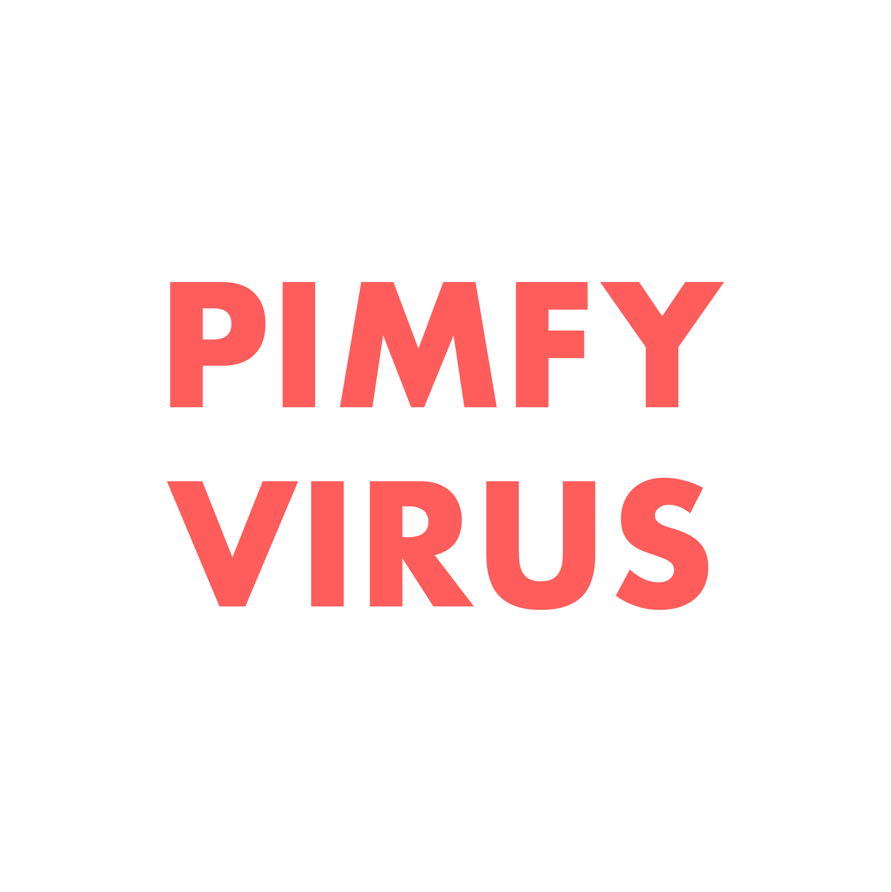
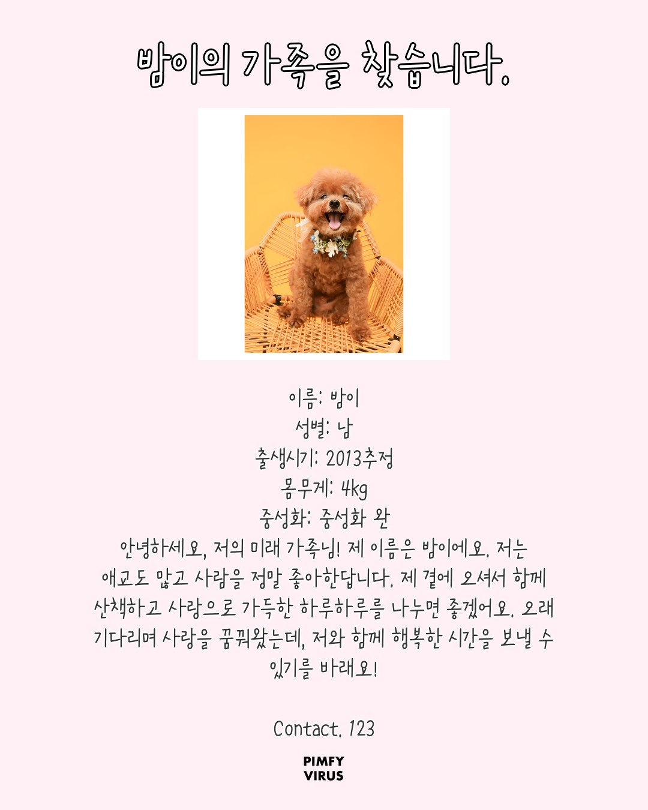

# 📸 PIMFY Photo (핌피포토)
> **유기견의 개성과 맥락을 시각화하는 AI 프로필 생성 서비스**

<p align="center">
  
  
</p>
<p align="center">
  <i>(왼쪽: 원본 유기동물 공고 데이터 / 오른쪽: AI를 통해 생성된 맞춤형 프로필)</i>
</p>


## 📝 프로젝트 개요 (Overview)
기존 유기견 공고 사진의 열악한 시각적 환경을 개선하기 위해 시작되었습니다. **PIMFY Photo**는 생성형 AI 기술을 활용해 유기견의 '가장 빛나는 순간'을 재구성하고, 데이터를 기반으로 감성적인 페르소나를 부여하여 실질적인 입양률 제고를 목표로 합니다.

- **개발 기간**: 2025.10 - 2026.02
- **고도화 기간**: 2026.01 - 진행중
- **핵심 가치**: 기술을 통한 사회적 가치 창출, 정량적 성능 최적화, 사용자 중심의 UX 개선

---

## 🏆 주요 성과 (Key Achievements)
- **AI 추론 성능 91% 개선**: 360초(6분) → **30초** 이내로 단축
- **인프라 효율화**: FP16 양자화를 통한 GPU 메모리 점유율 **50% 절감**
- **UX 최적화**: Web Share API 도입으로 이미지 저장 Depth 축소 (4단계 → **2단계**)

---

## 🔥 핵심 트러블슈팅 (Core Troubleshooting)

### 1️⃣ SDXL 모델 추론 최적화 (Latency 91% 단축)
- **문제**: 초기 SDXL 모델 도입 시, 이미지 한 장당 **약 6분(360초)**이 소요되어 실시간 서비스가 불가능한 병목 현상 발생.
- **원인**: API 요청 시마다 대용량 모델을 새로 로드하는 로직과 가중치(FP32)의 과도한 GPU 메모리 점유.
- **해결**: 
  - **전역 로딩(Singleton Pattern)**: 모델을 서버 구동 시 1회 메모리에 상주시켜 재사용하는 구조로 변경.
  - **FP16(Half Precision) 양자화**: 모델 가중치를 경량화하여 연산 속도 향상 및 GPU 메모리 병목 해소.
- **결과**: 추론 시간을 **30초 이내로 단축**하여 실질적인 서비스 운영 가능 상태 확보.


### 2️⃣ 모바일 저장 UX 개선 (Web Share API)
- **문제**: 모바일 브라우저 보안 정책으로 인해 다운로드 시 갤러리가 아닌 '파일 앱'으로 저장되는 UX 불편함 발견.
- **해결**: **Web Share API**를 도입하여 시스템 공유 시트를 호출, 사용자가 원클릭으로 **갤러리에 직접 저장**할 수 있도록 구현.

### 3️⃣ 데이터 정합성 및 네트워크 예외 처리
- **문제**: 특정 DB 환경에서 문자열이 `bytes` 타입으로 반환되어 서버 에러 유발 및 Mixed Content 보안 이슈로 이미지 렌더링 실패.
- **해결**: `safe_dec` 유틸리티 함수를 통한 타입 검증 로직 도입 및 이미지 데이터를 **Base64**로 인코딩하여 전송함으로써 통신 안정성 확보.

---

## 🏗 시스템 아키텍처 및 파이프라인


1. **Rembg & Real-ESRGAN**: 저화질 배경 제거 및 4배 업스케일링 화질 복구
2. **SDXL (CUDA 11.8)**: 개인화된 파스텔톤 배경 생성
3. **GPT-4o-mini**: 공고 데이터 기반 감성 스토리텔링 문구 생성
4. **Synthesis**: Pillow를 이용한 레이어 합성 및 UUID 기반 저장

---

## 🛠 기술 스택 (Tech Stack)
- **AI/ML**: SDXL, Real-ESRGAN, Rembg, GPT-4o-mini, TensorRT, CUDA 11.8
- **Backend**: FastAPI, SQLAlchemy, Docker, Naver Cloud Platform (V100 GPU)
- **Frontend**: Next.js (App Router), TypeScript, Tailwind CSS

---

## 🚀 시작하기 (Getting Started)

### 1. 저장소 복제 및 환경 설정
```bash
git clone [https://github.com/your-username/pimfy-photo.git](https://github.com/your-username/pimfy-photo.git)
cd pimfy-photo
